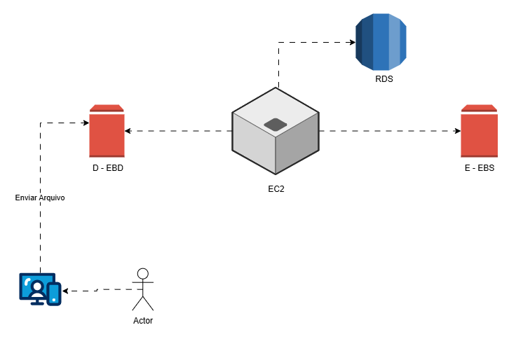
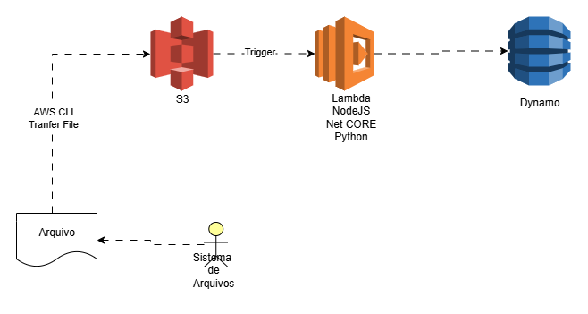

# AWS Learning

Este repositório contém desafios práticos de arquitetura AWS, representados em diagramas feitos no **draw.io**.

---

## Desafio 1 - EBS | EC2

📌 Objetivo: Criar uma instância EC2 integrada a um volume EBS e com banco RDS.

- [Diagrama no Google Drive](https://drive.google.com/file/d/1ngTSGHRpLcgmn9I5QISglw2e3RjajelW/view?usp=sharing)
- [Arquivo draw.io](desafio_ebs_ec2.drawio)

---

## Desafio 2 - S3 | Lambda Function

📌 Objetivo: Utilizar o S3 como gatilho para uma função Lambda que processa arquivos e armazena resultados no DynamoDB.

- [Diagrama no Google Drive](https://drive.google.com/file/d/14FQgxbir_HSWw-CweeWw9o_UGccz0wGN/view?usp=sharing)
- [Arquivo draw.io](desafio_s3_lambda.drawio)

---
